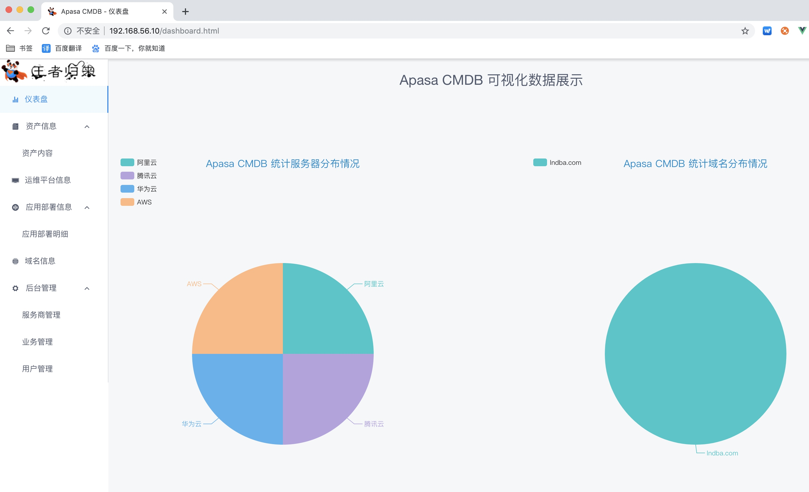

# Apasa CMDB前端部署
说明：V1.0版本由于种种限制，只能提供手动录入的功能，自动录入功能将在V2.0中更新。

## Apasa CMDB前后端组件说明
* 开发语言：Python 3.6
* 前端框架：Vue + iview
* 后端框架：Django + RestFramework + MySQL

## 前端代码部署
### 安装node.js
```
wget https://npm.taobao.org/mirrors/node/v10.15.1/node-v10.15.1-linux-x64.tar.gz
tar xf node-v10.15.1-linux-x64.tar.gz
cp -a node-v10.15.1-linux-x64 /usr/local/node
ln -s /usr/local/node/bin/node /usr/bin/node
ln -s /usr/local/node/bin/npm /usr/bin/npm
npm config set registry http://registry.npm.taobao.org/
```

### 编辑src/store/store.js修改后端API地址

### 编译Apasa CMDB前端代码
```
# 进入代码目录执行以下命令
npm install
npm run build
# 将编译后的dist目录拷贝到/data目录下
```

### Nginx配置
```
vim /etc/nginx/nginx.conf
server {
        listen       80;
        server_name  192.168.3.10;
        root   /data/dist;
        index  index.html index.htm;
        location / {
             try_files $uri $uri/ @router;
             index index.html;
        }
        location @router {
            rewrite ^.*$ /index.html last;
        }
}
# 重新加载nginx配置文件
```

### 访问



